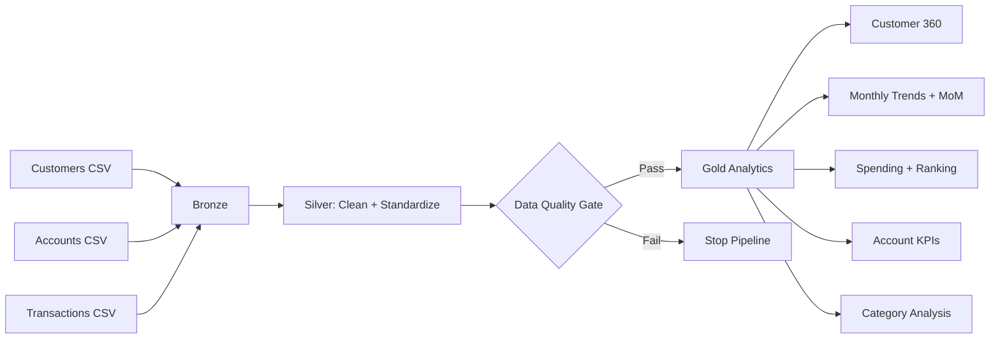

# Banking Customer & Transaction Analytics with PySpark

A portfolio-ready **Data Engineering** project demonstrating **PySpark + Medallion Architecture (Bronze → Silver → Gold)** for banking customer, account and transaction analytics.

## Business Objective

Build a reliable analytics pipeline that ingests customer, account and transaction data, applies a quality gate, enriches transaction data and produces business-ready Gold datasets for customer 360, transaction trends, spending analysis and account KPIs.

## Architecture



## Tech Stack

- Python 3.10+
- PySpark 3.5+
- pytest
- GitHub Actions
- Medallion Architecture
- DataFrame API / Spark SQL concepts

## Repository Structure

```text
banking-customer-transaction-analytics/
├── data/raw/                         # synthetic source data
├── notebooks/                        # Bronze/Silver/Gold demos + end-to-end pipeline
├── src/
│   ├── bronze/                       # ingestion + metadata
│   ├── silver/                       # cleansing + enrichment
│   ├── gold/                         # business analytics
│   ├── quality/                      # data-quality rules
│   └── utils/                        # Spark session helper
├── tests/                            # PySpark unit tests
├── docs/                             # business, data dictionary, Azure mapping
├── architecture/                     # Medallion architecture
├── .github/workflows/tests.yml       # CI quality gate
├── requirements.txt
└── README.md
```

## Medallion Flow

**Bronze** preserves source attributes and adds ingestion metadata.

**Silver** standardizes dates and numeric fields, removes duplicate business keys, validates identifiers and amounts, excludes failed transactions from analytics, and enriches transactions through customer/account joins.

**Gold** provides purpose-built datasets:

1. `customer_360`
2. `monthly_transaction_trends`
3. `customer_spending_analysis`
4. `account_kpis`
5. `category_analysis`

## Data Quality Gate

The pipeline validates:

- Required fields are not null
- Customer/account/transaction business keys are unique
- Transaction amounts are non-negative
- Account → Customer referential integrity
- Transaction → Account referential integrity
- Transaction → Customer referential integrity
- Transaction status is `Success` or `Failed`
- Transaction type is `Debit` or `Credit`
- Transaction table is not empty

Failed quality checks stop the Gold pipeline instead of publishing potentially incorrect analytics.

## Advanced PySpark Concepts Demonstrated

- CSV ingestion
- DataFrame transformations
- Type casting and date normalization
- Deduplication
- Multi-table joins
- Aggregations and conditional aggregation
- Window functions
- `dense_rank` for customer spending ranking
- `lag` for month-over-month comparison
- Running totals with window frames
- Referential-integrity validation
- Reusable transformation functions
- Automated PySpark unit tests
- CI/CD quality gate

## Run Locally

```bash
python -m venv .venv

# Windows
.venv\Scripts\activate

# Linux/macOS
source .venv/bin/activate

pip install -r requirements.txt
pytest -q
python notebooks/04_end_to_end_pipeline.py
```

The pipeline writes Gold CSV outputs under `output/`, which is intentionally excluded from Git.

## Gold Analytics Examples

### Customer 360
Combines customer profile, account count, total balance, transaction count, debit, credit and net transaction value.

### Monthly Transaction Trends
Provides monthly transaction count/value, average transaction value, previous-month value, MoM percentage change and running transaction value.

### Customer Spending
Ranks customers by successful debit spending using a Spark window function.

### Account KPIs
Aggregates account count and balances by account type and status.

### Category Analysis
Identifies the transaction categories driving debit spending.

## Example Business Questions

- Who are the top customers by debit spending?
- What is monthly transaction volume and value?
- How did transaction value change month over month?
- Which transaction categories drive spending?
- Which customers have the highest number of transactions?
- What is the total balance by account type?

## Azure Databricks Production Mapping

| Portfolio implementation | Azure production equivalent |
|---|---|
| CSV landing data | ADLS Gen2 landing zone |
| Bronze DataFrame | Bronze Delta table |
| Silver DataFrame | Silver Delta table |
| Gold DataFrame | Gold Delta tables/views |
| Local Spark | Azure Databricks compute |
| pytest/GitHub Actions | CI/CD quality gate |
| Local pipeline | Databricks Workflow / ADF |
| Local governance logic | Unity Catalog + Purview |

See `docs/azure_databricks_mapping.md` for productionization guidance.

## Productionization Roadmap

For a real banking workload I would additionally introduce:

- Delta Lake and ACID transactions
- Incremental ingestion and watermarking
- CDC/upsert handling
- Quarantine tables for rejected records
- Data reconciliation against source-system totals
- Structured logging and pipeline metrics
- Unity Catalog access controls and lineage
- Purview governance/catalog integration
- Parameterized Dev/Test/Prod configurations
- Databricks Workflows or ADF orchestration
- Monitoring and alerting

## Interview Talking Point

> "I designed a three-layer PySpark Medallion pipeline. Bronze preserves source data and ingestion metadata, Silver creates trusted standardized data and enforces quality rules, and Gold exposes business-specific analytics. I used joins, conditional aggregations and window functions for customer ranking, running totals and month-over-month analysis. The pipeline also has referential-integrity checks and automated tests, making the design portable to Azure Databricks."

## Portfolio Note

All datasets are **synthetic**. No real customer, account or financial information is used.
