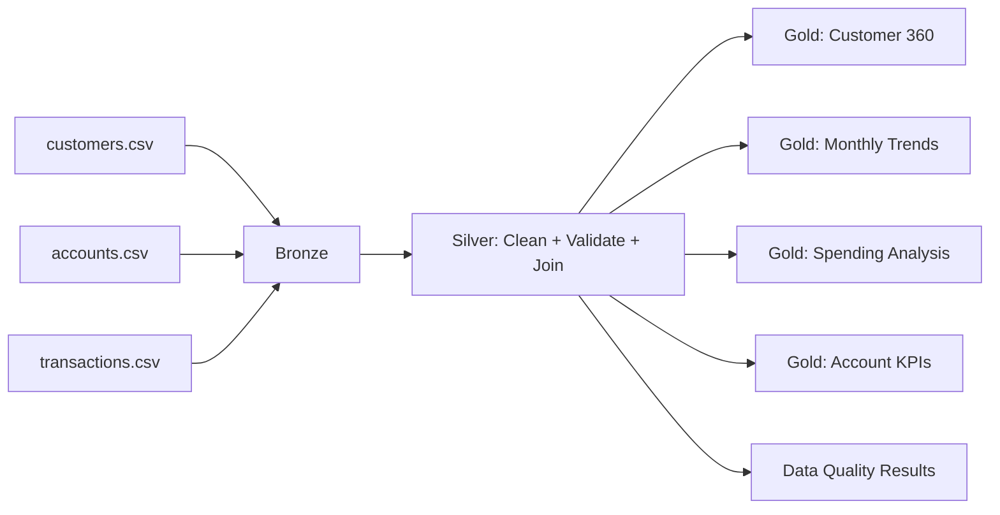

# Banking Customer & Transaction Analytics with PySpark

A portfolio-ready **Data Engineering** project demonstrating **PySpark + Medallion Architecture (Bronze → Silver → Gold)** for banking customer, account and transaction analytics.

## Business Objective

Build a reliable analytics pipeline that ingests customer, account and transaction data, applies data-quality rules and transformations, and produces business-ready Gold datasets for customer 360, transaction trends, spending analysis and account KPIs.

## Architecture



## Tech Stack

- Python 3.10+
- PySpark 3.5+
- pandas for lightweight inspection
- pytest
- GitHub Actions
- Medallion Architecture
- SQL-style analytics using DataFrame APIs and Spark SQL concepts

## Repository Structure

```text
banking-customer-transaction-analytics/
├── data/raw/                         # synthetic input data
├── notebooks/                        # executable learning/pipeline scripts
├── src/
│   ├── bronze/                       # ingestion
│   ├── silver/                       # cleansing + business transformations
│   ├── gold/                         # analytics datasets
│   ├── quality/                      # data-quality rules
│   └── utils/                        # Spark/session helpers
├── tests/                            # unit/integration-style tests
├── docs/                             # business, data dictionary, Azure mapping
├── architecture/                     # architecture documentation
├── .github/workflows/tests.yml       # CI
├── requirements.txt
└── README.md
```

## Medallion Flow

**Bronze:** preserve source structure and add ingestion metadata.

**Silver:** standardize columns/types, remove invalid records, deduplicate, enrich transactions with customer/account attributes, and derive business fields.

**Gold:** create analytics-ready datasets:

1. `customer_360`
2. `monthly_transaction_trends`
3. `customer_spending_analysis`
4. `account_kpis`
5. `category_analysis`

## Key PySpark Concepts Demonstrated

- Explicit schemas
- CSV ingestion
- Column transformations
- Data cleansing
- Null handling
- Deduplication
- Multi-table joins
- Aggregations
- Window functions
- `row_number`, `rank`, `dense_rank`
- Running totals
- Month-over-month analysis
- Conditional aggregation
- Data-quality validation
- Reusable pipeline functions
- Unit testing

## Run Locally

```bash
python -m venv .venv
# Windows
.venv\Scripts\activate
# Linux/macOS
source .venv/bin/activate

pip install -r requirements.txt
pytest -q
python notebooks/04_end_to_end_pipeline.py
```

The pipeline writes Gold output under `output/` (ignored by Git).

## Example Business Questions

- Who are the top customers by transaction value?
- What is monthly transaction volume and value?
- Which transaction categories drive spending?
- What is the average account balance by customer segment?
- Which customers have the highest number of transactions?
- What is the month-over-month change in transaction value?

## Azure Databricks Mapping

The same design maps naturally to Azure Databricks with ADLS Gen2 as storage, Delta Lake for Bronze/Silver/Gold tables, Unity Catalog for governance, Azure Key Vault for secrets and Azure Data Factory/Workflows for orchestration. See `docs/azure_databricks_mapping.md`.

## Important Portfolio Note

The datasets are **synthetic** and contain no real customer or financial information. The project is designed to demonstrate production-oriented engineering patterns without exposing sensitive data.

## Interview Talking Point

> "I designed a three-layer PySpark Medallion pipeline. Bronze preserves source data, Silver enforces quality and business-standard transformations, and Gold exposes purpose-built analytical datasets. I used joins and window functions for customer ranking, running totals and month-over-month analytics, and added automated data-quality checks and CI tests so the pipeline is repeatable and maintainable."
