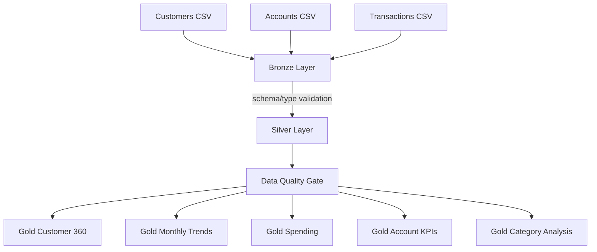

# Medallion Architecture

## Bronze

Purpose: source preservation and ingestion observability.

Typical production format: Delta tables in ADLS Gen2.

## Silver

Purpose: clean, standardize, deduplicate and enrich data.

Transformations include type casting, date normalization, null checks, duplicate removal, failed-transaction exclusion and joins across source entities.

## Gold

Purpose: optimized business consumption.

Datasets are shaped around business questions rather than source-system structure.
